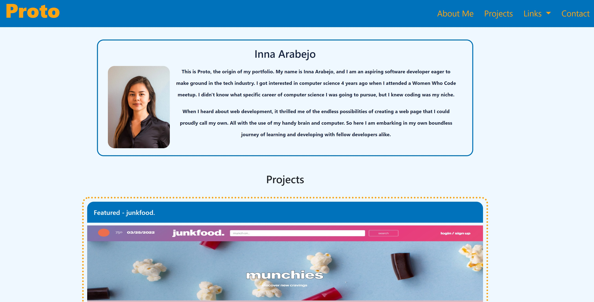

# Proto: The origin of my portfolio

## Description
Create a portfolio from scratch that displays projects you have done. These portfolios will assess your skills and show the thought process behind each project. Several projects created in the future will be added and displayed in this portfolio.

## Task
For a satisfactory portfolio, the following requirements are met when:
  - There is the developer's name, photo, links to sections about them, their work, and ways to contact the developer.
  - Links in the navigation will scroll to the corresponding section.
  - There is a section for the projects and the first image is larger in size than the others.
  - The image is clicked on, the application deploys to the actual site.
  - The Proto portfolio site can be resized to fit various screens and devices and is a responsive layout.

## Technologies Used
- HTML, CSS, Bootstrap v4.6

## Screenshot

.mp4…

)

## Link to the Final Page
[Proto Portfolio](https://inna-arabejo.github.io/creative-portfolio/)

## Sources Used
- https://www.w3schools.com/css/default.asp 
- https://coolors.co/

## License
This code is licensed under MIT.
