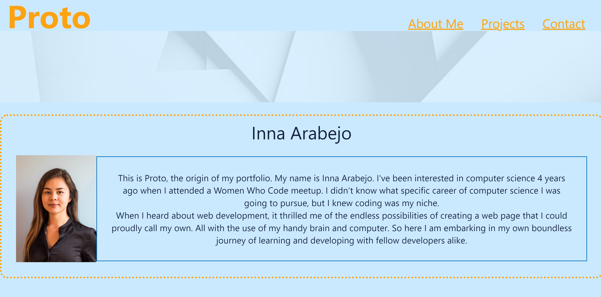

# Proto Portfolio: The Origin of my Portfolio

## Description
Create a portfolio from scratch that displays projects I have done. These portfolios will assess my skills and show the thought process behind each project. Several projects created in the future will be added and displayed in this portfolio.

## Task
For a satisfactory portfolio, the following requirements are met:
-Present the developer's name, photo, links to section, their work, and ways to contact the developer.
-Links in the navigation will scroll to the corresponding section.
-There is a section for the projects and the first image is larger in size than the others.
-When the image is clicked on, the application deploys to the actual site.
-The Proto portfolio site can be resized to fit various screens and devices and is responsive to layout.

## Screenshot

## Link To the Final Page
[Link to Proto portfolio web page]https://https://inna-arabejo.github.io/creative-portfolio/

## Contributions
Inpspiration from https://www.w3schools.com/css/default.asp and https://coolors.co/.
